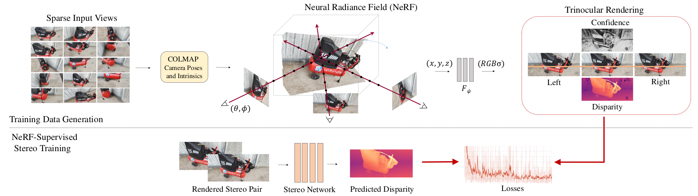
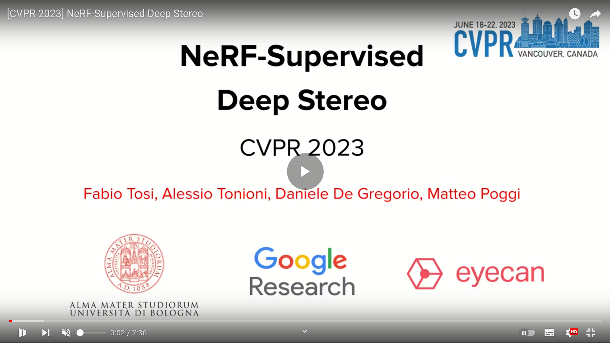
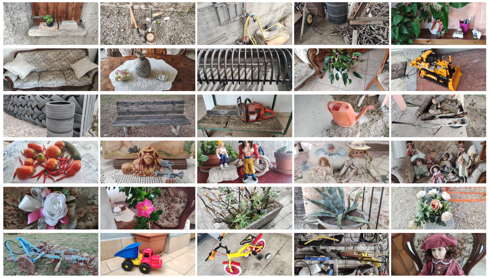
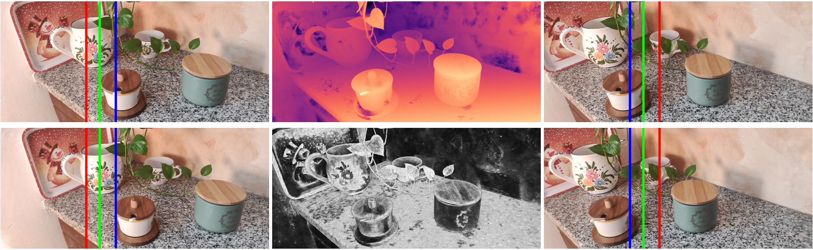
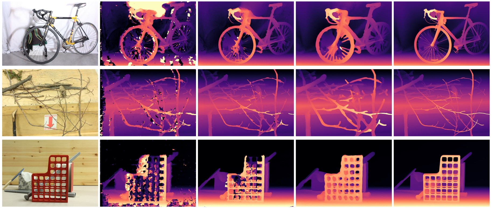
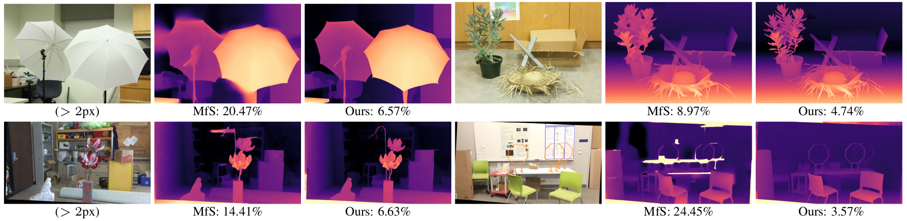

<h1 align="center"> NeRF-Supervised Deep Stereo (CVPR 2023) </h1>


<br>

This repository contains download links to our dataset, code snippets, and trained deep stereo models of our work  "**NeRF-Supervised Deep Stereo**",  [CVPR 2023](https://cvpr2023.thecvf.com/)
 
by [Fabio Tosi](https://fabiotosi92.github.io/)<sup>1</sup>, [Alessio Tonioni](https://alessiotonioni.github.io/)<sup>2</sup>, [Daniele De Gregorio](https://www.eyecan.ai/)<sup>3</sup> and [Matteo Poggi](https://mattpoggi.github.io/)<sup>1</sup>

University of Bologna<sup>1</sup>,  Google Inc.<sup>2</sup>,  Eyecan.ai<sup>3</sup>

<div class="alert alert-info">

**Note**: Kindly note that this repository is currently in the development phase. We are actively working to add and refine features and documentation. We apologize for any inconvenience caused by incomplete or missing elements and appreciate your patience as we work towards completion.

</div>

<h2 align="center"> 

[Project Page](https://nerfstereo.github.io/) | [Paper](https://openaccess.thecvf.com/content/CVPR2023/papers/Tosi_NeRF-Supervised_Deep_Stereo_CVPR_2023_paper.pdf) |  [Supplementary](https://github.com/fabiotosi92/NeRF-Supervised-Deep-Stereo/raw/main/assets/Tosi_et_al_CVPR2023_supplementary.pdf) | [Poster](https://github.com/fabiotosi92/NeRF-Supervised-Deep-Stereo/raw/main/assets/Tosi_et_al_CVPR2023_poster.pdf) | 📂 [Dataset](https://drive.google.com/drive/folders/1fkSneuLK3f3yW4VrFSsAsJEZ-Jys90l6)
</h2>

<h4 align="center">

</h4>



 

## Watch Our Research Video!

<a href="https://youtu.be/m7dqHkxb4yg">
  
</a>

**Contributions:** 

* Introducing a novel paradigm for **collecting** and **generating stereo training data** using **neural rendering** and <ins>a collection of user-captured image sequences</ins>. Our methodology revolutionizes stereo network training by leveraging readily available user-captured images, **eliminating the need for synthetic datasets, ground-truth depth, or even real stereo pairs**!

* A **NeRF-Supervised (NS) training protocol** that combines rendered image triplets and depth maps to address occlusions and enhance fine details. 

* **State-of-the art, zero-shot generalization** results on challenging stereo datasets, without exploiting any ground-truth or real stereo pair.


If you find this code useful in your research, please cite:

```bibtex
@inproceedings{Tosi_2023_CVPR,
    author    = {Tosi, Fabio and Tonioni, Alessio and De Gregorio, Daniele and Poggi, Matteo},
    title     = {NeRF-Supervised Deep Stereo},
    booktitle = {Proceedings of the IEEE/CVF Conference on Computer Vision and Pattern Recognition (CVPR)},
    month     = {June},
    year      = {2023},
    pages     = {855-866}
}
```


## Dataset

We collect a total of 270 high-resolution (8Mpx) scenes in both indoor and outdoor environments using **standard camera-equipped smartphones**. For each scene, we focus on a/some specific object(s) and acquire 100 images from different viewpoints, ensuring that the scenery is completely static. The acquisition protocol involves a set of either front-facing or 360° views.

<p float="left">
  
</p>

**Examples of scenes in our dataset.** Here we report individual examples derived from 30 different scenes that comprise our dataset.

[Download here](https://drive.google.com/drive/folders/1fkSneuLK3f3yW4VrFSsAsJEZ-Jys90l6)

After downloading the dataset from the provided link, you will find two folders:

1. 📂 **raw_data_v1**: This folder contains zip files for each of the 270 scenes. Inside each zip file, you will find raw RGB images at high-resolution captured using our smartphones, which were later used to generate stereo pairs using NeRF. It also includes the camera poses obtained through COLMAP.

2. 📂**stereo_dataset_v1**: In this folder, you will find zip files for each of the 270 scenes. Inside each zip file, you will find rendered stereo pairs generated by NeRF, along with corresponding disparity maps and AO maps. The disparity maps and AO maps are saved as 16-bit images. To obtain the actual disparity values, please divide the disparity map values by a factor of 64. Similarly, divide the AO map values by a factor of 65536. Please note that due to space constraints, we are providing the stereo images at 0.5Mpx only, used to train the stereo models released.


## Pretrained Models

Here, you can download the weights of **RAFT-Stereo** and **PSMNet** architectures. These models were trained from scratch on rendered triplets of our real-world dataset using our NeRF-Supervised training loss.

To use these weights, please follow these steps:

1. Create a folder named `weights` in the project directory.
2. Download the weights of the respective models:
   - For [RAFT-Stereo](https://github.com/princeton-vl/RAFT-Stereo), download the weights from [this link](https://drive.google.com/file/d/1zAX2q1Tr9EOypXv5kwkI4a_YTravdtsS/view?usp=sharing).
   - For [PSMNet](https://github.com/JiaRenChang/PSMNet), download the weights from [this link](https://drive.google.com/file/d/1kh0RGQW2s1id-G5VKPdqYi-x0Y2_cWi4/view?usp=sharing).
3. Copy the downloaded weights into the `weights` folder.


## Code

The **Test** section provides scripts to evaluate disparity estimation models on datasets like **KITTI**, **Middlebury**, and **ETH3D**. It helps assess the accuracy of the models and saves predicted disparity maps.

The **Demo** section allows you to quickly generate a disparity map for a pair of stereo images.

Please refer to each section for detailed instructions on setup and execution.

<div class="alert alert-info">

**Warning**:
- Please be aware that we will not be releasing the training code for deep stereo models. The provided code focuses on evaluation and demonstration purposes only.
- With the latest updates in PyTorch, slight variations in the quantitative results compared to the numbers reported in the paper may occur.

</div>


### Setup Instructions

1. **Dependencies**: Ensure that you have installed all the necessary dependencies. The list of dependencies can be found in the `./code_snippets/requirements.txt` file.

2. **Clone the repositories**:
   - For RAFT-Stereo:
     - Clone the RAFT-Stereo repository by running the following command:
       ```shell
       git clone https://github.com/princeton-vl/RAFT-Stereo
       ```
     - Navigate to the cloned repository and copy the contents of the `core` folder.
   - For PSMNet:
     - Clone the PSMNet repository by running the following command:
       ```shell
       git clone https://github.com/JiaRenChang/PSMNet
       ```
     - Navigate to the cloned repository and copy the contents of the `models` folder.

3. **Paste files**: Paste the copied contents into the `./models/raft-stereo` or `./models/psmnet` folder in your project directory.


## Test

This code snippet allows you to evaluate the disparity maps on various datasets, including [KITTI (2012 and 2015)](https://www.cvlibs.net/datasets/kitti/eval_scene_flow.php?benchmark=stereo), [Middlebury (Training, Additional, 2021)](https://vision.middlebury.edu/stereo/data/), and [ETH3D](https://www.eth3d.net/). By executing the provided script, you can assess the accuracy of disparity estimation models on these datasets.

To run the `test.py` script with the correct arguments, follow the instructions below:

1. **Run the test**:
   - Open a terminal or command prompt.
   - Navigate to the directory containing the `test.py` script.

2. **Execute the command**:
   Run the following command, replacing the placeholders with the actual values for your images and model:

   ```shell
   python test.py  --datapath <path_to_dataset> --dataset <dataset_type> --version <dataset_version> --model <model_name> --loadmodel <path_to_pretrained_model> --maxdisp <max_disparity> --outdir <output_directory> --occ
   ```

  Replace the placeholders (<max_disparity>, <path_to_dataset>, <dataset_type>, etc.) with the actual values for your setup.

  The available arguments are:

  - `--datapath`: Path to the dataset.
  - `--dataset`: Dataset type. (e.g., `middlebury`, `kitti`)
  - `--version`: Specify the dataset version.
  - `--model`: Select the model. Options: `raft-stereo`, `psmnet`
  - `--outdir`: Output directory to save the disparity maps.
  - `--loadmodel`: Path to the pretrained model file.
  - `--occ`: Include occluded regions in the evaluation process.
  - `--maxdisp`: Maximum disparity value (default 256).

For more details, please refer to the `test.sh` script in the `code_snippet` folder.


## Demo

You can use the `demo.py` script to estimate a disparity map from a single stereo pair. The script will run and produce the predicted disparity, which will be saved at the specified output path. Follow the instructions below to run the demo:

1. **Run the demo**:
   - Open a terminal or command prompt.
   - Navigate to the directory containing the `demo.py` script.

2. **Execute the command**:
   Run the following command, replacing the placeholders with the actual values for your images and model:


```shell
python demo.py --left <path_to_left_image> --right <path_to_right_image> --output <path_to_output_disparity> --model <model_name> --loadmodel <path_to_pretrained_model> --maxdisp <max_disparity>

```
   - `--left`: Path to the left image.
   - `--right`: Path to the right image.
   - `--output`: Path to save the predicted disparity map.
   - `--model`: Select the model. Options: `psmnet` or `raft-stereo`.
   - `--loadmodel`: Path to the pretrained model file.
   - `--maxdisp`: Maximum disparity value (default 256).


Make sure to replace the placeholders `<path_to_left_image>`, `<path_to_right_image>`, `<path_to_output_disparity>`, `<model_name>`, `<path_to_pretrained_model>`, and `<max_disparity>` with the actual values for your images and model.

**Example**: You can try the trained deep stereo models using the sample stereo pair from the Middlebury dataset available in the `images` folder. You can use the provided `im0.png` and `im1.png` images as follows:

```shell
python demo.py --left images/im0.png --right images/im1.png --output images/disparity_map.png --model raft-stereo --loadmodel ./weights/raftstereo-NS.tar
```

This command will estimate a disparity map using the selected deep stereo model (`raft-stereo`) on the provided stereo pair (`im0.png` and `im1.png`). The predicted disparity will be saved as `disparity_map.png` in the images folder.

If you haven't downloaded the pretrained models yet, you can find the download links in the **Pretrained Models** section above.

## Training NeRF

To train a NeRF model starting from a scene captured with a single camera, you can utilize various NeRF implementations available. One such implementation that we have used in our experiments is [Instant-NGP](https://github.com/NVlabs/instant-ngp). Instant-NGP offers high accuracy and fast training times, making it suitable for training multiple NeRF models and rendering thousands of images quickly.

Please refer to the Instant-NGP repository and follow their instructions for training NeRF models. While we used Instant-NGP in our experiments, you are free to choose any other NeRF implementation that suits your needs.

In addition, we provide a code snippet named `generate_stereo_pair_matrix.py` in the `code_snippets` folder. This code is used to generate stereo pairs from a **transform.json** file, which is typically used in Instant-NGP. You can use this code to facilitate the creation of stereo pairs for your NeRF training. Feel free to customize and adapt it according to your specific requirements.


## Qualitative Results

In this section, we present illustrative examples that demonstrate the effectiveness of our proposal.

<p float="left">

</p>
 

**Arbitrary Baseline.** Here, we show the remarkable capability of NeRF to effortlessly produce stereo pairs with arbitrary baseline configurations, employing them on a diverse array of scenes captured from our newly curated collection of images.
 
<p float="left">
  
</p>


**Examples of Rendered Images and Depth from NeRF.** We show examples on a scene of our dataset. In each case, the leftmost and rightmost columns show the rendered left and right images in a triplet, respectively. These images were obtained using small, medium, and large baselines, as indicated by the red, green, and blue lines. The center column, from top to bottom, shows the center image in the triplet, its corresponding rendered disparity map, and ambient occlusion map. Here, we adopt the Instant-NGP framework to render images.

<br>

<p float="left">
  
</p>

**Effect of Training Losses.** From left to right: reference image, disparity maps computed by the RAFT-Stereo network trained using the popular binocular photometric loss between two images of a rectified stereo pair, the triplet photometric loss between three horizontally aligned images, the proxy-supervised loss from Aleotti et al., ECCV 2020 and, finally, our proposed NeRF-Supervised loss.  Please zoom-in to better perceive fine-details. 


<br>

<p float="left">
  
</p>

**Qualitative Comparison on Midd-A H (top) and Midd-21 (bottom).** From left to right: left images and disparity maps by RAFT-Stereo models, respectively trained with MfS or NS. Under each disparity map, the percentage of pixels with error > 2.


## Contacts

For questions, please send an email to fabio.tosi5@unibo.it or m.poggi@unibo.it

(*) *This is not an officially supported Google product.* 


## Acknowledgements

We would like to extend our sincere appreciation to the authors of the following projects for making their code available, which we have utilized in our work:

- We would like to thank the authors of [PSMNet](https://github.com/JiaRenChang/PSMNet), [RAFT-Stereo](https://github.com/princeton-vl/RAFT-Stereo) and [CFNet](https://github.com/gallenszl/CFNet) for providing their code, which has been instrumental in our stereo matching experiments.

- We express our gratitude to the authors of [Instant-NGP](https://github.com/NVlabs/instant-ngp) for releasing their code, enabling us to train accurate NeRF models efficiently.

- We would like to thank the authors of [Stereo-from-Mono](https://github.com/nianticlabs/stereo-from-mono) for their code, which has been valuable in our evaluation of disparity maps.

We deeply appreciate the authors of the competing research papers for their helpful responses, and provision of model weights, which greatly aided accurate comparisons.